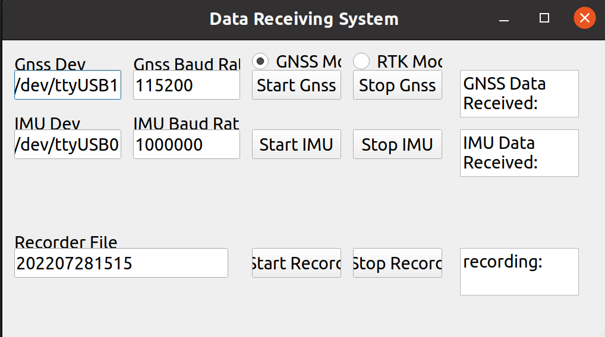
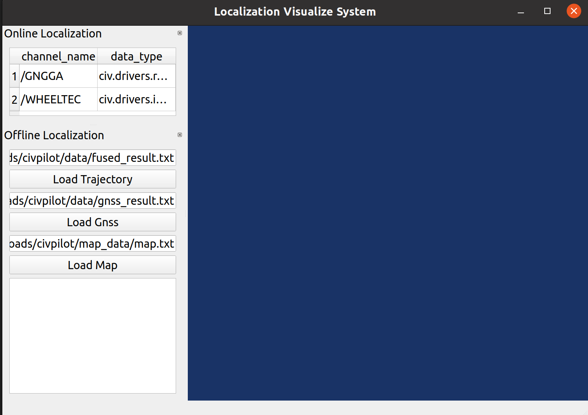
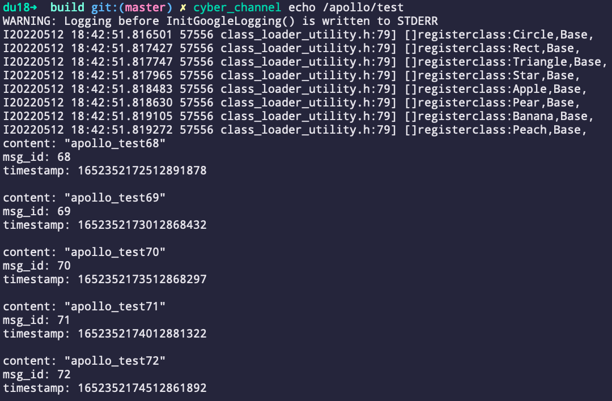

# Apollo(v8.0.0) CyberRT

## #1 Env

1. > dependence

```shell
sudo apt update
sudo apt install -y libpoco-dev uuid-dev libncurses5-dev python3-dev python3-pip libeigen3-dev
python3 -m pip install protobuf==3.14.0
```

2. > absl
```shell
wget https://apollo-system.cdn.bcebos.com/archive/6.0/20200225.2.tar.gz
tar -xzvf 20200225.2.tar.gz
cd abseil-cpp-20200225.2
```

add the following cmake command in CMakeLists.txt \
set(CMAKE_CXX_FLAGS "${CMAKE_CXX_FLAGS} -std=c++11")
```shell
cmake -DBUILD_SHARED_LIBS=ON -L CMakeLists.txt && make
sudo make install
```

3. > proj
```shell
sudo apt-get install libproj-dev
sudo apt install sqlite3
```
Download projxxxx.tar.gz from from https://proj.org/download.html
```shell
wget https://download.osgeo.org/proj/proj-9.0.1.tar.gz
tar -xzvf proj-9.0.1.tar.gz
cd proj-9.0.1
mkdir build
cd build
cmake ..
cmake --build .
sudo make install
```

4. > OpenCV

If we want to visualize something, we need to install OpenCV
```shell
sudo apt-get install libpng-dev libjpeg-dev libopenexr-dev libtiff-dev libwebp-dev    

https://docs.opencv.org/4.x/d2/de6/tutorial_py_setup_in_ubuntu.html
git clone https://github.com/opencv/opencv.git
cd opencv
mkdir build
cd build
cmake ../
make -j16
sudo make install
```
Attention, if we have already installed Anaconda, it may cause some problems in the installation of OpenCV. Please temporarily move Anaconda

5. > QT 5.12 \

If we want to use UI, we need to install QT
```shell
sudo apt-get install libxcb-xfixes0-dev gperf bison flex xserver-xorg libclang-dev
```

refer to https://doc.qt.io/archives/qt-5.12/linux-building.html
https://download.qt.io/archive/qt/5.12/5.12.12/ \
download qt-everywhere-src-5.12.12.tar.xz 
```shell
wget https://download.qt.io/archive/qt/5.12/5.12.12/single/qt-everywhere-src-5.12.12.tar.xz
tar -xf qt-everywhere-src-5.12.12.tar.xz
cd qt-everywhere-src-5.12.12
./configure
make -j16
make install
sudo apt install libqt5x11extras5-dev
sudo apt install libqt5serialport5
sudo apt install libqt5serialport5-dev
```
Download qt-opensource-linux-x64-5.12.12.run, Run it and install only Qt-Creator1
```shell
wget https://download.qt.io/archive/qt/5.12/5.12.12/qt-opensource-linux-x64-5.12.12.run
./qt-opensource-linux-x64-5.12.12.run
```

Test QT
QT designer \
If everything is OK, we will be able to launch the designer interface
```shell
/usr/local/Qt-5.12.12/bin/designer
```

6. > VTK 8.2.0

If we want to use Viewer, we need to install VTK from https://vtk.org/download/

dependencies
```shell
sudo apt-get install qttools5-dev
sudo apt install libxt-dev
```

```shell
wget https://vtk.org/files/release/8.2/VTK-8.2.0.tar.gz
tar -xzvf VTK-8.2.0.tar.gz
sudo apt install cmake-qt-gui
cd VTK-8.2.0
cd build
cmake-gui (source code is folder VTK-8.2.0, and build the binary should be folder build. Select qt related items, then press "configure","generate")
make
sudo make install 
```

## #2 Build

1. clone

```shell
git clone git@github.com:foxbao/civpilot8.git
cd civpilot8
git checkout -b dev origin/dev
```

2. build third party \
If we download the code for the first time and want to build from zero, delete the folder third_party and install if they exist

> install

```shell
./scripts/install.sh
```

> export path

```shell
source install/setup.bash
```

3. build cyber and the whole project

```shell
source install/setup.bash
mkdir build && cd build
cmake ..
make -j$(nproc)
```

## #3 Test of Cyber

1. pub/sub

> talker

```shell
source build/setup.bash
./cyber/examples/cyber_example_talker
```
> listener

```shell
source build/setup.bash
./cyber/examples/cyber_example_listener
```

2. component

```shell
source build/setup.bash
cyber_launch start share/examples/common.launch
./cyber/examples/common_component_example/channel_prediction_writer
./cyber/examples/common_component_example/channel_test_writer
```

2. cyber_monitor
```shell
source build/setup.bash
cyber_monitor
```

## #4 Launch of data receiver
1. Start IMU
```shell
sudo chmod 777 /dev/ttyXXX (allowing program to read from the serial port of imu)
cd build
source setup.bash
cd ..
./build/driver/imu/wheeltec_component /dev/ttyUSB0 1000000
```
Or we can simpy use the bash
```shell
sudo bash ./imu_reading.sh
```
(do not forget to change the /dev/ttyX accordingly)

2. Start gnss reading 
```shell
sudo chmod 777 ttyXXX(R3900 is ttyUSBX, and ublox is ttyACMX)
source build/setup.bash
./build/driver/gnss/gnss_component_test /dev/ttyUSB1 115200
```

3. Start RTK module and connect with qianxun
```shell
sudo chmod 777 ttyXXX
source /opt/cyber/env/setup.bash
source build/setup.bash
./build/driver/qianxun/qianxun_app /dev/ttyUSB1 115200
```
Or we can simpy use the bash
```shell
sudo bash ./rtk_reading.sh
```
(do not forget to change the /dev/ttyX accordingly)

4. Start interface_qt \
An alternative and easier way to read the sensor data is using the interface_qt, if compiled
```shell
source build/setup.bash
./build/driver/interface_qt/recorder_qt
```


5. Data Recorder \
To facilitate the offline debug, we can record the sensor data received into a file
```shell
source build/setup.bash
cyber_recorder record -a -o example_data
```
6. Data Player \
The recorded data can be played again
```shell
source build/setup.bash
cyber_recorder play -f example_data
```

## #5 Start civloc 
After the reading from sensor is started, we can launch the localizing program

```shell
./build/civloc/test --flagfile=/home/baojiali/Downloads/civpilot/civloc/conf/vw.conf --minloglevel=0
```

## #6 Start civview
A more sophiscated UI civview is also provided to visually launch and show the localizaion result, which facilitates the debug process. To use it, we need to enable the civview in CMakeLists.txt in root folder
```shell
source build/setup.bash
./build/civview/core/civview_core
```



## #6 Tools

1. channel

> list

```shell
source setup.bash
cyber_channel list

# The number of channels is:  1
# /apollo/test
```

> echo
```shell
source setup.bash
cyber_channel echo /apollo/test
```


> more ...

```shell
Commands:
	cyber_channel list	list active channels
	cyber_channel info	print information about active channel
	cyber_channel echo	print messages to screen
	cyber_channel hz	display publishing rate of channel
	cyber_channel bw	display bandwidth used by channel
	cyber_channel type	print channel type
```

2. node

```shell
Commands:
	cyber_node list 	List active nodes.
	cyber_node info 	Print node info.
```

3. service

```shell
Commands:
	cyber_service list	list active services
	cyber_service info	print information about active service
```

4. launch

```shell
cyber_launch start share/examples/common.launch
```

5. monitor

```shell
cyber_monitor
```

6. recorder

```shell
Commands:
  	cyber_recorder info	Show information of an exist record.
	cyber_recorder play	Play an exist record.
	cyber_recorder record	Record same topic.
	cyber_recorder split	Split an exist record.
	cyber_recorder recover	Recover an exist record.
```

## #6 Package

```shell
cmake -DCMAKE_INSTALL_PREFIX=/you/install/path ..
make
make package
sudo dpkg -i package/*.deb
```
