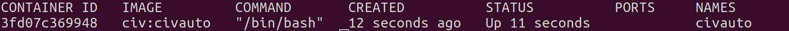
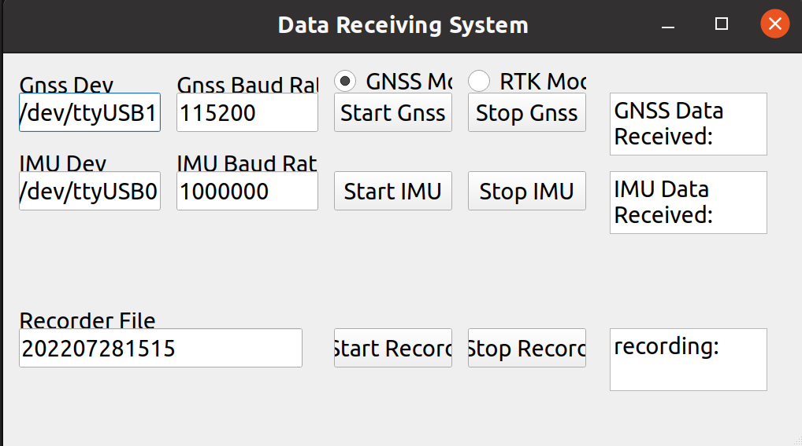
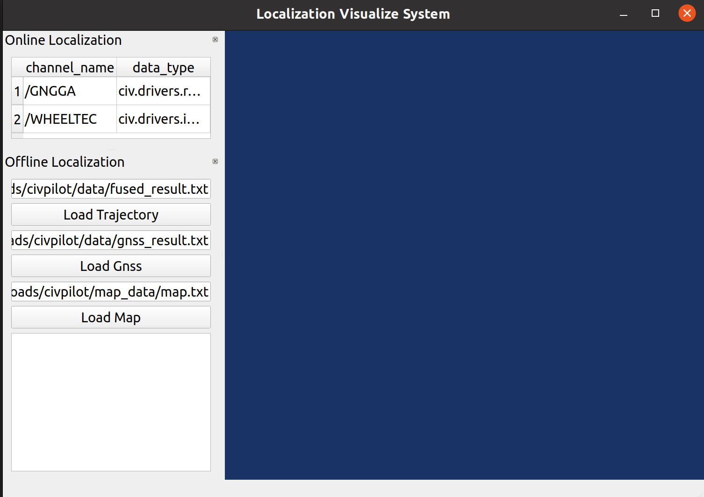

# CivPilot
CivPilot 是一个自动驾驶平台，目前主要功能是实现高精度定位，中间件基于百度阿波罗的cyber

- [CivPilot](#civpilot)
	- [简介](#简介)
	- [代码下载](#代码下载)
	- [Docker方式安装](#docker方式安装)
		- [编译Docker](#编译docker)
		- [启动Docker容器](#启动docker容器)
		- [进入docker容器](#进入docker容器)
		- [编译cyber与整个civpilot项目](#编译cyber与整个civpilot项目)
	- [Normal Version Installation](#normal-version-installation)
		- [Download source code](#download-source-code)
		- [Dependency](#dependency)
		- [Download Code and Build Third Party](#download-code-and-build-third-party)
		- [Build cyber and the whole project](#build-cyber-and-the-whole-project)
	- [启动传感器](#启动传感器)
	- [Data Recorder Player](#data-recorder-player)
	- [Start Civloc](#start-civloc)
	- [启动Civview可视化程序](#启动civview可视化程序)
	- [Tools](#tools)
	- [#6 Package](#6-package)
## 简介

## 代码下载
```shell
git clone git@github.com:foxbao/civpilot8.git
```
And checkout the dev branch
```shell
cd civpilot8
git checkout -b dev origin/dev
```
## Docker方式安装
使用docker是本项目最简单的安装和运行方式。docker相关文件位于docker/build下。请确保docker/build目录下含有下图中的所有文件。其中有两个文件需要从百度网盘下载，链接如下  
cmake-3.16.0.tar.gz, link：https://pan.baidu.com/s/1mrFneIqKtS_6vmeZb7jJBA , passwd：1234  
third_party_civpilot.zip, link: https://pan.baidu.com/s/1racV6nXaHjWpa3d7RAci-Q, code:1234  
```shell
├── base.x86_64.dockerfile
├── build_docker.sh
├── cmake-3.16.0.tar.gz
├── README.md
├── scripts
│   ├── apollo.bashrc
│   ├── dev_start.sh
│   ├── docker_base.sh
│   ├── FastRTPS_1.5.0.patch
│   └── install.sh
└── third_party_civpilot.zip
```
### 编译Docker
本项目包含一个无可视化界面的base版docker与一个包含了opencv、qt等可视化工具的full版本，参阅docker/build/README.md。以下给出了无可视化版本的docker编译方法
```shell
cd docker/build
docker build  -f base.x86_64.dockerfile -t civ:civauto .
```

编译完成之后，我们可以查看确认docker镜像已经产生
```shell
sudo docker images
```


### 启动Docker容器
镜像产生之后，我们可以基于镜像启动一个容器
First, please remove install and third_party in civpilot8 folder if they exist.
```shell
cd civpilot8
rm -rf install
rm -rf third_party
docker run --rm -i -d -v `pwd`:/home/baojiali/Downloads/civpilot8 --name civauto civ:civauto
(bash ./docker_start.sh)
```


我们可以通过以下命令确定容器已经启动
```shell
sudo docker container ls
```


### 进入docker容器
```shell
cd civpilot8
docker exec -it civauto /bin/bash
(bash ./docker_into.sh)
```
docker容器启动之后，编译、运行等工作都可以在容器内执行

### 编译cyber与整个civpilot项目
在docker模式下，third_party目录与civpilot8目录平级，故编译过程与普通编译过程略有不同

```shell
cd civpilot8
source ../third/install/setup.bash
mkdir build && cd build
cmake ..
make -j$(nproc)
```

## Normal Version Installation

If we do not want to use docker and hope to know every details in the installation to make sure that everything is OK, we can use the normal installation mode.
### Download source code

### Dependency
1. libs

```shell
sudo apt update
sudo apt install -y libpoco-dev uuid-dev libncurses5-dev python3-dev python3-pip libeigen3-dev 
sudo apt install -y wget cmake curl libcurl4-openssl-dev git
python3 -m pip install protobuf==3.14.0
```
2. cmake 3.16
```shell
wget https://github.com/Kitware/CMake/releases/download/v3.16.0/cmake-3.16.0.tar.gz
tar -zxvf cmake-3.16.0.tar.gz
cd cmake-3.16.0
./bootstrap
make -j16
make install
```

3. absl
```shell
wget https://apollo-system.cdn.bcebos.com/archive/6.0/20200225.2.tar.gz
tar -xzvf 20200225.2.tar.gz
cd abseil-cpp-20200225.2
```

add the following cmake command in CMakeLists.txt \
set(CMAKE_CXX_FLAGS "${CMAKE_CXX_FLAGS} -std=c++11")
```shell
sed -i '23i set(CMAKE_CXX_FLAGS "${CMAKE_CXX_FLAGS} -std=c++11")' CMakeLists.txt
cmake -DBUILD_SHARED_LIBS=ON -L CMakeLists.txt && make -j$(nproc)
sudo make install
```

4. proj
```shell
sudo apt-get install libproj-dev sqlite3 libtiff-dev
```
Download projxxxx.tar.gz from from https://proj.org/download.html
```shell
wget https://download.osgeo.org/proj/proj-9.0.1.tar.gz
tar -xzvf proj-9.0.1.tar.gz
cd proj-9.0.1
mkdir build
cd build
cmake ..
cmake --build .
sudo make install
```

5. OpenCV (Optional)

If we want to visualize something, we need to install OpenCV
https://docs.opencv.org/4.x/d2/de6/tutorial_py_setup_in_ubuntu.html
```shell
sudo apt-get install libpng-dev libjpeg-dev libopenexr-dev libtiff-dev libwebp-dev    
git clone https://github.com/opencv/opencv.git
cd opencv
mkdir build
cd build
cmake ../
make -j16
sudo make install
```
Attention, if we have already installed Anaconda, it may cause some problems in the installation of OpenCV. Please temporarily move Anaconda

6. QT 5.12 (Optional)

If we want to use UI, we need to install QT
```shell
sudo apt-get install libxcb-xfixes0-dev gperf bison flex xserver-xorg libclang-dev
```

refer to https://doc.qt.io/archives/qt-5.12/linux-building.html
https://download.qt.io/archive/qt/5.12/5.12.12/ \
download qt-everywhere-src-5.12.12.tar.xz 

```shell
wget https://download.qt.io/archive/qt/5.12/5.12.12/single/qt-everywhere-src-5.12.12.tar.xz
tar -xf qt-everywhere-src-5.12.12.tar.xz
cd qt-everywhere-src-5.12.12
./configure
make -j16
make install
sudo apt install libqt5x11extras5-dev
sudo apt install libqt5serialport5
sudo apt install libqt5serialport5-dev
```
Download qt-opensource-linux-x64-5.12.12.run, Run it and install only Qt-Creator1
```shell
wget https://download.qt.io/archive/qt/5.12/5.12.12/qt-opensource-linux-x64-5.12.12.run
./qt-opensource-linux-x64-5.12.12.run
```

Test QT
QT designer \
If everything is OK, we will be able to launch the designer interface
```shell
/usr/local/Qt-5.12.12/bin/designer
```

7. VTK 8.2.0 (Optional)

If we want to use Viewer, we need to install VTK from https://vtk.org/download/

dependencies
```shell
sudo apt-get install qttools5-dev
sudo apt install libxt-dev
```

```shell
wget https://vtk.org/files/release/8.2/VTK-8.2.0.tar.gz
tar -xzvf VTK-8.2.0.tar.gz
sudo apt install cmake-qt-gui
cd VTK-8.2.0
cd build
cmake-gui (source code is folder VTK-8.2.0, and build the binary should be folder build. Select qt related items, then press "configure","generate")
make
sudo make install 
```

### Download Code and Build Third Party

1. Build third party 
> Clean existing third parties

If we download the code for the first time and want to build from zero, delete the folder third_party and install if they exist
```shell
rm -rf third_party
rm -rf install
```
> Download and install third parties

If we have a good connection to Github, simply run the script. It will download the libs like protobuf, gflags and install them
```shell
./scripts/install.sh
```

> Use local third_party file to build

Otherwise, if the connection to Github is poor, which is very common in certain region, we can extract the protobuf, glags and other third party libs in the third_party_civpilot.zip and install them. This zip file is disponible via Baidu storage
https://pan.baidu.com/s/1racV6nXaHjWpa3d7RAci-Q
code:1234

Run at the project folder
```shell
unzip -d third_party/ third_party_civpilot.zip
./scripts/install.sh
```

> export path

```shell
source install/setup.bash
```

### Build cyber and the whole project

```shell
source install/setup.bash
mkdir build && cd build
cmake ..
make -j$(nproc)
```


## 启动传感器
1. 启动IMU
```shell
sudo chmod 777 /dev/ttyXXX (allowing program to read from the serial port of imu)
source build/setup.bash
./build/driver/imu/wheeltec_component /dev/ttyUSB0 1000000
```
If everything OK, we can check the imu data in cyber_monitor


Or we can simpy use the bash
```shell
sudo bash ./imu_reading.sh
```
(do not forget to change the /dev/ttyX accordingly)

2. Start gnss reading 
```shell
sudo chmod 777 ttyXXX(R3900 is ttyUSBX, and ublox is ttyACMX)
source build/setup.bash
./build/driver/gnss/gnss_component_test /dev/ttyUSB1 115200
```

If everything OK, we can check the gnss data in cyber_monitor

3. Start RTK module and connect with qianxun
```shell
sudo chmod 777 ttyXXX
source build/setup.bash
./build/driver/qianxun/qianxun_app /dev/ttyUSB1 115200
```
Or we can simpy use the bash
```shell
sudo bash ./rtk_reading.sh
```
(do not forget to change the /dev/ttyX accordingly)

4. Start interface_qt

An alternative and easier way to read the sensor data is using the interface_qt, which requires the qt to be built, and need to activate the compilation in driver/CMakeLists.txt
```shell
source build/setup.bash
./build/driver/interface_qt/recorder_qt
```



## Data Recorder Player
1. Data Recorder \
To facilitate the offline debug, we can record the sensor data received into a file
```shell
source build/setup.bash
cyber_recorder record -a -o example_data
# ex
cyber_recorder record -a -o 202307251424
```
2. Data Player \
The recorded data can be played again
```shell
source build/setup.bash
cyber_recorder play -f example_data
# ex 
cyber_recorder play -f 202307251424.000*
```
We have prepared some sample data, so you can play this file to facilitate the debug, which is disponible vis baidu
https://pan.baidu.com/s/1tL7HkXVNG8o9wTCJdhUepQ
code:1234
```shell
unzip data data.zip
cyber_recorder play -f data/202207211650/202207211650.000*
```

## Start Civloc 
After the reading from sensor is started, we can launch the Online localization program civloc. It reads in the sensor information from topics of cyber, and then uses filter to calculate the localization
1. Online mode
(we may need to modify the path of the vw.conf)
```shell
source build/setup.bash
./build/civloc/test -dag_file_path=./civloc/middle_ware/cyber/dag/HS5.dag
```
note1: we need to figure out --minloglevel=0 \
note2: if we are not in docker, we need to change the path of config_file_path and flag_file_path in HS5.dag, and also the paths in vw.conf \
You can also use cyber_recoder play to play a file and then use the online mode

2. Offline mode

The offline reads the sensor data like 202207211650.0000* directly and run the localizing program, which facilitates the debug.
```shell
./build/civloc/middle_ware/cyber/tool/civloc_component_offline -dag_file_path=/home/baojiali/Downloads/civpilot8/civloc/middle_ware/cyber/dag/HS5.dag -recorder_file_path=/home/baojiali/Downloads/civpilot8/data/202207211650/202207211650.0000*
```
Similarly, we can use
```shell
cyber_monitor
```  
to check if the localization result is output, or even use the civview to visually check as described in the following chapter


## 启动Civview可视化程序
为了便于直观地查看定位程序结果与地图，以及进行代码调试，我们也提供了Civview可视化工具。为了编译Civview模块，需要在civpilot8目录下地CMakeLists中添加civview一项。
启动方式如下
```shell
source build/setup.bash
./build/civview/core/civview_core
```
我们提供了某一区域的地图以便演示，可以从百度网盘下载
https://pan.baidu.com/s/12udaR8wdoXRxJl70IzdYQQ 
code:1234
```shell
unzip map_data map_data.zip
```



## Tools
Here are some useful tools provided by Cyber
1. channel

> list

```shell
source build/setup.bash
cyber_channel list

# The number of channels is:  1
# /apollo/test
```

> echo
```shell
source build/setup.bash
cyber_channel echo /apollo/test
```


> more ...

```shell
Commands:
	cyber_channel list	list active channels
	cyber_channel info	print information about active channel
	cyber_channel echo	print messages to screen
	cyber_channel hz	display publishing rate of channel
	cyber_channel bw	display bandwidth used by channel
	cyber_channel type	print channel type
```

2. node

```shell
Commands:
	cyber_node list 	List active nodes.
	cyber_node info 	Print node info.
```

3. service

```shell
Commands:
	cyber_service list	list active services
	cyber_service info	print information about active service
```

4. launch

```shell
cyber_launch start share/examples/common.launch
```

5. monitor

```shell
cyber_monitor
```

6. recorder

```shell
Commands:
  	cyber_recorder info	Show information of an exist record.
	cyber_recorder play	Play an exist record.
	cyber_recorder record	Record same topic.
	cyber_recorder split	Split an exist record.
	cyber_recorder recover	Recover an exist record.
```

## #6 Package

```shell
cmake -DCMAKE_INSTALL_PREFIX=/you/install/path ..
make
make package
sudo dpkg -i package/*.deb
```
